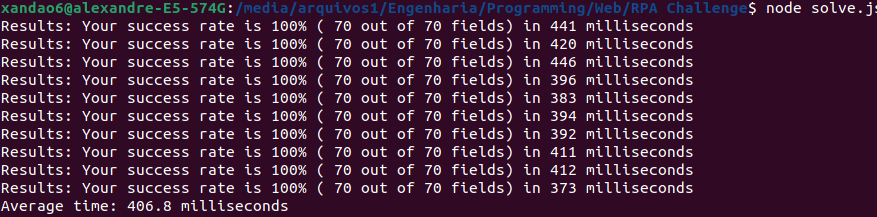

<br />
<p align="center">
  <h3 align="center">RPA Challenge</h3>

  <p align="center">
	<a href="http://www.rpachallenge.com/">RPA Challenge</a> is a competition where you need to automate some input filling and submitting. The approach used in this project to solve the problem was to use Puppeteer (aka headless Chrome) and Node.js to automate the process very quickly.
    <br />
	<br />
    <a href="https://github.com/xandao6/rpa-challenge"><strong>Explore the docs »</strong></a>
    <br />
    <a href="https://github.com/xandao6/rpa-challenge/issue">Report Bug</a>
    ·
    <a href="https://github.com/xandao6/rpa-challenge/issues">Request Feature</a>
  </p>
</p>


<!-- TABLE OF CONTENTS -->
<details open="open">
  <summary>Table of Contents</summary>
  <ol>
    <li>
      <a href="#about-the-project">About The Project</a>
      <ul>
        <li><a href="#features">Features</a></li>
        <li><a href="#built-with">Built With</a></li>
      </ul>
    </li>
    <li>
      <a href="#getting-started">Getting Started</a>
      <ul>
        <li><a href="#installation">Installation</a></li>
      </ul>
    </li>
    <li><a href="#usage">Usage</a></li>
    <li><a href="#roadmap">Roadmap</a></li>
    <li><a href="#contributing">Contributing</a></li>
    <li><a href="#license">License</a></li>
    <li><a href="#contact">Contact</a></li>
  </ol>
</details>


<!-- ABOUT THE PROJECT -->
## About The Project

<div align="center">
  <a href="https://github.com/xandao6/rpa-challenge">
    
	
	
  </a>
</div>

### Features

* Conversion of XLSX file to JSON
* Fast information filling and submitting

### Built With

* [Node.js](https://nodejs.org/) - A JavaScript runtime build on Chrome's V8 JS Engine
* [Puppeteer](https://github.com/puppeteer/puppeteer) - A headless Chrome browser for automation
* [node-xlsx](https://github.com/mgcrea/node-xlsx) - A node.js module to read and write excel files


<!-- GETTING STARTED -->
## Getting Started

To get a local copy up and running follow these simple steps.

### Installation

1. Clone the repo
   ```sh
   git clone https://github.com/xandao6/rpa-challenge.git
   ```
2. Install dependencies
   ```sh
	cd rpa-challenge
	npm install # or yarn install
	```

<!-- USAGE EXAMPLES -->
## Usage

* Run the project
	```sh
  npm run start # or yarn start
  ```

<!-- ROADMAP -->
## Roadmap

See the [open issues](https://github.com/xandao6/rpa-challenge/issues) for a list of proposed features (and known issues).


<!-- CONTRIBUTING -->
## Contributing

Contributions are what make the open source community such an amazing place to be learn, inspire, and create. Any contributions you make are **greatly appreciated**.

1. Fork the Project
2. Create your Feature Branch (`git checkout -b feature/AmazingFeature`)
3. Commit your Changes (`git commit -m 'Add some AmazingFeature'`)
4. Push to the Branch (`git push origin feature/AmazingFeature`)
5. Open a Pull Request

<!-- LICENSE -->
## License

Distributed under the MIT License. See [LICENSE](./LICENSE.md) for more information.

Free software =)


<!-- CONTACT -->
## Contact

Alexandre Calil - [@xandao6](https://www.linkedin.com/in/xandao6/) - alexandrecalilmf@gmail.com

Project Link: [https://github.com/xandao6/rpa-challenge](https://github.com/xandao6/rpa-challenge)


<!-- LINKS & IMAGES Variables-->
<!-- https://www.markdownguide.org/basic-syntax/#reference-style-links -->
[contributors-shield]: https://img.shields.io/github/contributors/xandao6/repo.svg?style=for-the-badge
[contributors-url]: https://github.com/xandao6/repo/graphs/contributors
[forks-shield]: https://img.shields.io/github/forks/xandao6/repo.svg?style=for-the-badge
[forks-url]: https://github.com/xandao6/repo/network/members
[stars-shield]: https://img.shields.io/github/stars/xandao6/repo.svg?style=for-the-badge
[stars-url]: https://github.com/xandao6/repo/stargazers
[issues-shield]: https://img.shields.io/github/issues/xandao6/repo.svg?style=for-the-badge
[issues-url]: https://github.com/xandao6/repo/issues
[license-shield]: https://img.shields.io/github/license/xandao6/repo.svg?style=for-the-badge
[license-url]: https://github.com/xandao6/repo/blob/master/LICENSE.txt
[linkedin-shield]: https://img.shields.io/badge/-LinkedIn-black.svg?style=for-the-badge&logo=linkedin&colorB=555
[linkedin-url]: https://linkedin.com/in/xandao6
